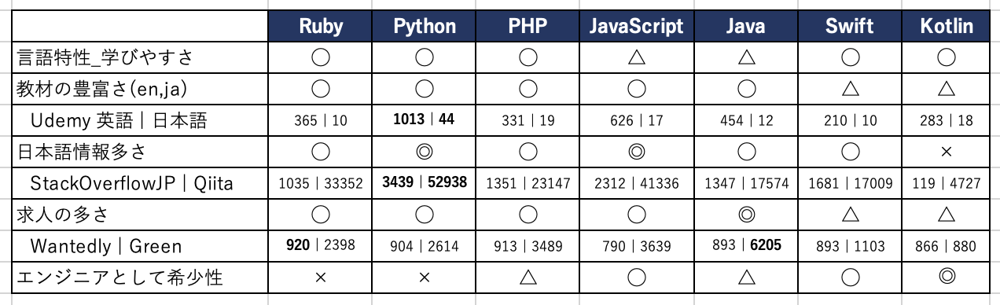
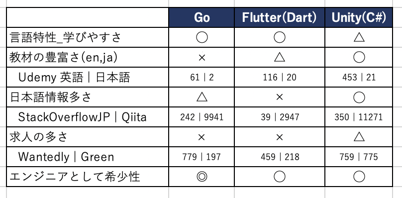

## YouTube動画の資料です
プログラミング言語の選び方【未経験からのエンジニア転職】〜前編〜

https://youtu.be/bBociebIuqI

プログラミング言語の選び方【未経験からのエンジニア転職】〜後編〜

https://youtu.be/HU44WKEX6tw

# エンジニア就職目指す人のための「プログラミング言語の選び方」
### はじめに
- 先日ヒヤリングした人が「プログラミング言語の選び方」を悩んでいた
- 🤔「PHPでいいのか？」
- 今日は「つくりたいものがない人」向けの話
- とにかくITエンジニア就職を成功させたい人向け
##
##
##
##

---

## オサミーのプログラミング言語歴
- Java(業務Webアプリ 1年, Androidアプリ 3年)
- Objective-C(iOSアプリ 4年)
- Swift (iOSアプリ 5年以上) ***←メイン***
- Kotlin (Androidアプリ 1年未満)
- Python (データ分析/深層学習 1年未満)
- Ruby (管理系Railsアプリ 1年)
- 最近は JavaScript, TypeScript(1年未満)
  - Webアプリのバックエンド(Firebase)
  - Webアプリのフロントエンド(React)
##
##

---

##### エンジニア就職目指す人のための「プログラミング言語の選び方」
## 結論：
## Ruby, PHP, JavaScript, Java, Python, Swift, Kotlin
# ↑ なんでもよい！

※つくりたいものがない人向けです
### 学習しはじめてる人はそのまま学習続けましょう！💪
### そのまま頑張ってください！💪💪💪

---

# 言いたいことは以上！
### 学習しはじめてる人はここで閉じていただいてOKです！🙆‍♂️
### この動画は これから「学習しはじめてない人向け」です！
- 詳細(前提や補足など)説明します
- プログラミング言語の比較してみます ***←動画のメイン***
  - 「学びやすさ」や「案件数」など

##
##
##
##
##

---

### エンジニア就職目指す人のための「プログラミング言語の選び方」
## 目次
- 前提: エンジニア就職とは
- 補足1: つくりたいものがあれば それをつくれる言語がおすすめ
- 補足2: もし自分だったら◯◯を選ぶ
- 各プログラミング言語の比較 ***←メイン***
  - Ruby, Python, PHP, JavaScript 前編はここまで
  - *** ここから後編***
  - Java, Swift, Kotlin
  - 番外編: Go, Flutter(Dart), Unity(C#)
  - まとめ
##

---

## 前提：エンジニア就職とは

### プログラミングする「おしごと」の企業はいろいろあるよ！今回は全部！
#### ①SIer(大小問わず受託企業含む)②SES企業③自社開発企業(スタートアップ含む) すべて含みます

- ①SIer:
  - 基本情報などの「資格」が重宝される, 年収上げるにはPMになる必要
- ②SES企業: 
  - 客先常駐.ディスられがちの企業.仕事内容/環境はマジでピンきり(案件ガチャ)
- ③自社開発企業:
  - 「ソフトウェアエンジニア」やっていきたいならココ!
  - 働き方の自由度高め!
##

---

## 補足1：「つくりたいものがあれば それをつくれる言語がおすすめ」
【サービス領域4選】
①ゲーム②スマホアプリ③Webアプリ④データ分析/機械学習
【おすすめ言語】
①ゲーム作りたい人→C# (Unity)
②スマホアプリ作りたい人→Swift, Kotlin
③Webアプリ作りたい人→Ruby, PHP, JavaScript,(Python)
④データ分析/機械学習やりたい人→Python 

### つくりたい(=好き)という気持ちが重要
- 一番成長がはやい
- 就職しやすい(受かりやすい)
※マストではないです、ベターというだけです

##

---

## 補足2: もし自分だったら...(つくりたいものがない状態)
- JavaScript学んで, SPA(Single Page Application)つくれるスキルを身につける
- フロントエンド〜バックエンドまですべてJavaScriptで書く
  - フロント→React
  - バックエンド→AWSのLambda, API Gateway, DynamoDB

### 理由
- 自分は「③自社開発企業」のうちのスタートアップ 就職目指したいから
  - ※ただし難易度がめちゃくちゃ高い
- SPA, SSRの流行. 
  - いま〜これからの技術として アツイ領域だから
##
##
##

---

## 各言語を5つの軸で比較してみました
Ruby, Python, PHP, JavaScript, Java, Swift, Kotlin
番外編: Go, Flutter(Dart), Unity(C#)
### 比較する「軸」
- ①言語特性としての学びやすさ(学習コストの低さ)
  - 主観
- ②教材の豊富さ
  - Udemyヒット数(英語/日本語)
- ③日本語情報の多さ
  - StackOverflowタグ数(日本語), Qiita記事数
- ④求人の多さ***←重要***
  - Wantedly, Greenの求人数
- ⑤人材として希少性(競争の緩さ)***←重要***
  - 主観

---

## 言語説明 ※できるだけ主観を抜いた客観的な情報
- その言語の特徴は？
- その言語を使って何を実現できるか？

## オサミーコメント　※完全に主観
- ①書く楽しさ
- ②就職について(企業とか)
- ③コミュニティとか その他
##
##
##
---

## Ruby
- ①言語特性としての学びやすさ：◯
- ②教材の豊富さ：◯
  - Udemyヒット数 英語：365, 日本語：10
- ③日本語情報の多さ：◯
  - StackOverflowタグ数：1035, Qiita：33352
- ④求人の多さ：◯
  - [求人数]Wantedly：920, Green：2398
- ⑤人材として希少性(競争の緩さ)：×
##
##
##
##

---

## Rubyとは
- 国産(”Matz”ことまつもとゆきひろさん作)のプログラミング言語
- 思想は「プログラミングを楽しめること」
- 1995年誕生 = Javaに比べると歴史浅め
- "Ruby on Rails"のおかげで世界規模に発展
- Ruby on Rails使えば手軽に「Webアプリ」つくれる
- 実行スピードは比較的遅い. がRuby3で速くなったらしい
- 2010年代のスタートアップはほとんどRailsアプリだった

#### 😎書いてて楽しい, 学びやすい！
#### 😎プログラミングスクール生増えまくりで競争厳しめ,ポートフォリオづくりで差別化頑張る必要
#### 😎Rubyは日本だけ(海外では最近Rubyの勢い落ちてる)

---

## Python

- ①言語特性としての学びやすさ(学習コストの低さ)：◯
- ②教材の豊富さ：◯
  - Udemyヒット数 英語：1013◎, 日本語：44
- ③日本語情報の多さ：◎
  - StackOverflow：3439, Qiita：52938
- ④求人の多さ：◯
  - [求人数]Wantedly：904, Green：2614
- ⑤人材として希少性(競争の緩さ)：×
##
##
##
##

---

## Pythonとは
- Webアプリやデータ分析、機械学習、ちょっとした自動化ツール開発など、色々できるプログラミング言語
- 生まれて30年の歴史 1991年(Ruby, PHPと同時期)
- 思想は「コードの読みやすさと効率を重視」誰が書いても同じようなコードに.
- 実行スピードはぼちぼち. RubyやPHPの最新バージョンと同等か抜かれた?

#### 😎Rubyに比較すると楽しさは劣る, が超簡単に書けて学びやすい！
#### 😎最近、機械学習ブームや自動化ブーム(YouTube上だけｗ)でやりたい人増えすぎ
→競争厳しめ(日本に限らず世界の流れ=AIブーム)
#### 😎ポートフォリオづくりで差別化頑張る必要あり
##
##
---

## PHP

- ①言語特性としての学びやすさ(学習コストの低さ)：◯
- ②教材の豊富さ：◯
  - Udemyヒット数 英語：311, 日本語：19
- ③日本語情報の多さ：◯
  - StackOverflow：1351, Qiita：23147
- ④求人の多さ：◯
  - [求人数]Wantedly：913, Green：3489
- ⑤人材として希少性(競争の緩さ)：△
##
##
##

---

## PHPとは
- 動的なWebページ作成するために生まれたプログラミング言語
- 1995年誕生(RubyやPythonと同時期)
- 2000年代 LAMP(Linux, Apache, MySQL, PHP)環境で大流行
- セキュリティ問題が過去にあった
- 実行スピードは遅い.　がPHP7.xは速いらしい
- 世界シェアNo1のCMS(コンテンツ管理システム)であるWordPressに使われる

#### 😎書き方がいろいろあってややこしい！でも簡単に実行できるので学びやすい！
#### 😎レガシーな(古い)印象あるけど、まだまだ案件ありそう= LAMPアプリ保守案件 or Wordpress案件?
#### 😎Rubyよりも受託企業が多い印象
#### 😎Wordpress向けなので、PHPエンジニアは、どちらかというとWebアプリ開発というより、企業ホームページ制作といった「Web制作」のお仕事多め
#### 😎就職はRuby,Pythonよりも競争やや緩いか?

---

## JavaScript

- ①言語特性としての学びやすさ(学習コストの低さ)：△
- ②教材の豊富さ：◯
  - Udemyヒット数 英語：626, 日本語：17
- ③日本語情報の多さ：◎
  - StackOverflow：2312, Qiita：41336
- ④求人の多さ：◯
  - [求人数]Wantedly：790, Green：3639
- ⑤人材として希少性(競争の緩さ)：◯
##
##
##
##

---
## JavaScriptとは
- Webブラウザの表示部分(フロントエンド)を操作するためのプログラミング言語
- (生まれた経緯はRuby, PHP, Pythonと違う)
- 他にも バックエンドも、デスクトップアプリも、スマホアプリもつくれる
- 1995年誕生 = Rubyなどと同じくらいの歴史
- 最近はJavaScriptに「型」の機能を追加したTypeScriptが大流行

#### 😎書き方色々あってムズい！動かすのは簡単だが学習するのはやや難しいかも
#### 😎frontend(React/Vue/jQuery他)とbackend(Node.js)も色々できるぜ〜！
#### 😎求人数も多め. とにかく就職したいならGOOD(ただし就職時は絞る必要あり)
#### 😎自分だったらJavaScript(TypeScript)やる
##

---

## Java

- ①言語特性としての学びやすさ(学習コストの低さ)：△
- ②教材の豊富さ：◯
  - Udemyヒット数 英語：454, 日本語：12
- ③日本語情報の多さ：◯
  - StackOverflow：1347, Qiita：17574
- ④求人の多さ：◎
  - [求人数]Wantedly：893, Green：6205
- ⑤人材として希少性(競争の緩さ)：△
##
##
##

---

## Javaとは
- WebアプリやAndroidアプリをつくれるプログラミング言語
- 1990年誕生,95年公開
- 日本では最もエンジニア数が多い
- 実行スピードは速い, 安全に書けるなど特徴
- 金融系など大規模システムで使われる

#### 😎SIer, SES企業含めると求人数ダントツ! 案件クソ多い. Java書けるエンジニア多.
その分炎上プロジェクトも多い, ピンきり.
#### 😎とにかく就職したいならGOOD👍 スタートアップは少なめ👎
#### 😎書いてる楽しさ低め,学習コスト高め, 開発環境構築だけでつまずきがち
#### 😎専門学生や職業訓練校でやるので意外と学んでる人は多い(推測)

---

## Swift

- ①言語特性としての学びやすさ(学習コストの低さ)：◯
- ②教材の豊富さ：△
  - Udemyヒット数 英語：210, 日本語：10
- ③日本語情報の多さ：◯
  - StackOverflow：1681, Qiita：17009
- ④求人の多さ：△
  - [求人数]Wantedly：893, Green：1103
- ⑤人材として希少性(競争の緩さ)：◯
##
##
##

---

## Swiftとは
- iPhone/iPadアプリをつくれるプログラミング言語
- 2014年発表=近代的(モダン)
- Apple社が開発, OSSへ
- 思想「モダン、安全、高速、インタラクティブ」

#### 😎書いてて楽しい, 動かすの簡単! 学習コストも低め!
#### 😎自分のiPhoneでアプリ動かせるのは楽しいぞ〜！圧倒的「俺のアプリ感」
#### 😎学ぶ人はRubyやPythonより少なめ、求人も少なめ→競争率変わらず？
#### 😎Apple好きならSwiftを推したい
##

---

## Kotlin 

- ①言語特性としての学びやすさ(学習コストの低さ)：◯
- ②教材の豊富さ：△
  - Udemyヒット数 英語：283, 日本語：18
- ③日本語情報の多さ：×
  - StackOverflow：119, Qiita：4727
- ④求人の多さ：△
  - [求人数]Wantedly：866, Green：880
- ⑤人材として希少性(競争の緩さ)：◎
##
##
##

---

## Kotlinとは
- Javaの弱点を補うプログラミング言語
- JetBrains社が開発
- Java仮想マシン上で動き、Javaよりも簡潔に書けるのが特徴
- できることはJavaと同じ. ただし今はAndroidアプリがメインか.
- 2011年発表=近代的(モダン)

#### 😎今からAndroidアプリつくるにはKotlinだ
でもなかなかJava勢が強いからあまり勢いを感じない...
日本ではiPhoneユーザーが多いからか...Flutterの方が勢い感じる...
#### 😎書いてて楽しい,学習コスト低め, 「俺のアプリ感」
#### 😎致命的に日本語情報少ない=エンジニア少ない
#### 😎人気のわりには 意外と求人もあるので 穴場かも?

---

## 番外編
Go, Flutter(Dart), Unity(C#)

---

## Go 

- ①言語特性としての学びやすさ(学習コストの低さ)：◯
- ②教材の豊富さ：×
  - Udemyヒット数 英語：61, 日本語：2
- ③日本語情報の多さ：△
  - StackOverflow：242, Qiita：9941
- ④求人の多さ：×
  - [求人数]Wantedly：779, Green：197
- ⑤人材として希少性(競争の緩さ)：◎
##
##
##
---

## Goとは
- Googleが開発した2009年発表のモダンなプログラミング言語
- 「Javaのように大規模システムでスケールし、
- Ruby/Pythonのように生産性高く、可読性も高く、簡潔に書ける」
- など他言語のいいとこどりな特徴を持つ
- 主にサーバーサイド(バックエンド)の言語
- コンパイル・実行速度が速い. 「並行処理」が得意.

#### 😎これから稼げる言語だと思う(大きめなスタートアップで流行り)
メルカリとか. 「マイクロサービス」がkeyword
#### 😎求人少なめ. が、希少性は高い=初学者でやってる人見たことない
#### 😎ハイリスク・ハイリターンを目指したい人はぜひ
バックエンドエンジニアとして Rubyから入ってGoエンジニアになるが無難か

---

## Flutter(Dart)

- ①言語特性としての学びやすさ(学習コストの低さ)：◯
- ②教材の豊富さ：△
  - Udemyヒット数 英語：116, 日本語：20
- ③日本語情報の多さ：×
  - StackOverflow：39, Qiita：2947(Flutter)
- ④求人の多さ：×
  - [求人数]Wantedly：459, Green：218(Flutter)
- ⑤人材として希少性(競争の緩さ)：◯
##
##
##
---

## Flutterとは
- マルチな端末で動くUIフレームワーク. iOS/Android/Webアプリつくれる
- Googleが開発, 2017年発表(モダン)

## Dartとは
- Flutterアプリをつくれるプログラミング言語
- Googleが開発, 2011年発表(モダン)
- JavaScript代替として誕生→しかし代替断念. そしてFlutterで使われ世界へ

#### 😎個人開発向け/超少人数スタートアップ向けかな
#### 😎なので未経験からの就職はかなり厳しめ
#### 😎でもかなり最近は勢いはあるぅぅ！(2.0でWebアプリも正式対応した)

---

## Unity(C#)

- ①言語特性としての学びやすさ(学習コストの低さ)：△
- ②教材の豊富さ：◯
  - Udemyヒット数 英語：435, 日本語：21
- ③日本語情報の多さ：◯
  - StackOverflow：350, Qiita：11271(Unity)
- ④求人の多さ：△
  - [求人数]Wantedly：759, Green：775
- ⑤人材として希少性(競争の緩さ)：◯
##
##
##
---

## Unityとは
- Unity Technologies社が開発してる「開発環境(IDE)を含んだ, ゲームエンジン」
- 3Dゲームはもちろん, 2Dゲームも開発できる
- 個人ゲーム開発者に大人気(世界シェアNo1). 

## C#とは
- Microsoft社が開発した 2002年発表のプログラミング言語.
- Unity以外にもWindowsデスクトップアプリなどで使用

#### 😎求人少なめ, ただし希少性は高い
#### 😎ゲームはまだまだ伸びる市場だと思う💪
AR, VR市場はいつ立ち上がるの...!?
#### 😎C#が結構ムズい気がする(学習コスト高め)

---

## まとめると

#### 結論、どれでもいいです！ 好きなもの選びましょう！あとでスイッチしてもOK!
- 年収や自由度が高い「ソフトウェアエンジニア」を目指すならRubyやJavaScriptが無難
- ラクして就職したいならJavaが無難. ただし,就活時の企業選び気をつけてね.

---

## まとめ2

#### このへんは少し厳しいかも. 無難戦略を好む人にはおすすめしない
- ただし「好き」で学習できれば、就職は問題なしかと！
- ハイリスク・ハイリターンが好きな人にぜひ☺️
##
